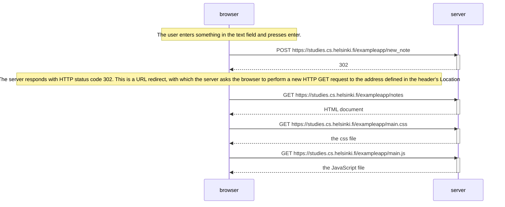

```mermaid
sequenceDiagram
    participant browser
    participant server

    Note over browser: The user enters something in the text field and presses enter.
    browser->>server: POST https://studies.cs.helsinki.fi/exampleapp/new_note
    activate server
    server-->>browser: 302
    deactivate server

    Note over browser: The server responds with HTTP status code 302. This is a URL redirect, with which the server asks the browser to perform a new HTTP GET request to the address defined in the header's Location

    browser->>server: GET https://studies.cs.helsinki.fi/exampleapp/notes
    activate server
    server-->>browser: HTML document
    deactivate server

    browser->>server: GET https://studies.cs.helsinki.fi/exampleapp/main.css
    activate server
    server-->>browser: the css file
    deactivate server

    browser->>server: GET https://studies.cs.helsinki.fi/exampleapp/main.js
    activate server
    server-->>browser: the JavaScript file
    deactivate server
```
