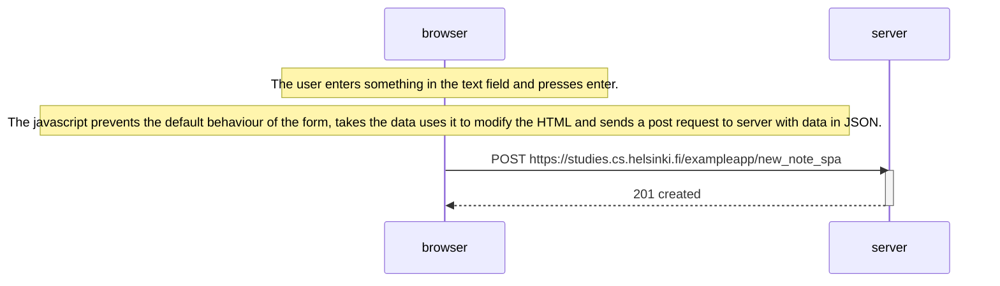

```mermaid
sequenceDiagram
    participant browser
    participant server

    Note over browser: The user enters something in the text field and presses enter.
    Note over browser: The javascript prevents the default behaviour of the form, takes the data uses it to modify the HTML and sends a post request to server with data in JSON.

    browser->>server: POST https://studies.cs.helsinki.fi/exampleapp/new_note_spa
    activate server
    server-->>browser: 201 created
    deactivate server

```
